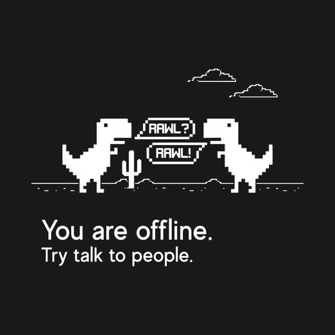

<div align="center">



[](https://opensource.org/licenses/MIT)
[](https://www.python.org/downloads/)
[](https://en.wikipedia.org/wiki/C_(programming_language))

<h3>A unified hub for learning and implementing projects in <b>multiple languages</b> (Python & C).</h3>
</div>

---

## 🔹 Project Roadmap

```
| Difficulty   | Project                        | Folder | Python | C |
| ------------ | ------------------------------ | ------ | :----: | :-: |
| Beginner     | Number Guessing Game           | [Link](projects/number_guessing_game/) | [ ] | [ ] |
| Beginner     | Simple Calculator              | [Link](projects/simple_calculator/)    | [ ] | [ ] |
| Beginner     | Rock, Paper, Scissors          | [Link](projects/rock_paper_scissors/)  | [ ] | [ ] |
| Beginner     | To-Do List (CLI)               | [Link](projects/todo_list/)            | [ ] | [ ] |
| Beginner     | Quiz App                       | [Link](projects/quiz_app/)             | [ ] | [ ] |
| Beginner     | Sudoku                         | [Link](projects/sudoku/)               | [ ] | [ ] |
| Beginner     | Brickout                       | [Link](projects/brickout/)             | [ ] | [ ] |
| Intermediate | Tic-Tac-Toe / Snake Game       | [Link](projects/tic_tac_toe/)          | [ ] | [ ] |
| Intermediate | Student Record System          | [Link](projects/student_record_system/)| [ ] | [ ] |
| Intermediate | Banking System (Mini-ATM)      | [Link](projects/banking_system/)       | [ ] | [ ] |
| Intermediate | Library Management System      | [Link](projects/library_management_system/)| [ ] | [ ] |
| Advanced     | LRU Cache                      | [Link](projects/lru_cache/)            | [ ] | [ ] |
| Advanced     | Custom Shell / Mini Bash Clone | [Link](projects/custom_shell/)         | [ ] | [ ] |
| Advanced     | File Compression Tool (Huffman)| [Link](projects/file_compression/)     | [ ] | [ ] |
| Advanced     | Encryption/Decryption Tool     | [Link](projects/encryption_tool/)      | [ ] | [ ] |
| Advanced     | Markdown → HTML Converter      | [Link](projects/markdown_converter/)   | [ ] | [ ] |
```

- Beginner | Intermediate | Advanced  
- ✔️ Mark progress by replacing `[ ]` with `[x]`.
---

## 🔹 Data Structures Projects

<div style="overflow-x: auto; padding: 10px; border: 1px solid #ddd; border-radius: 6px;">

| Project                     | Folder                                   | Python | C |
| ---------------------------- | ---------------------------------------- | :----: | :-: |
| Stack Implementation         | [Link](projects/stack/)                   | [ ]    | [ ] |
| Queue Implementation         | [Link](projects/queue/)                   | [ ]    | [ ] |
| Linked List                  | [Link](projects/linked_list/)             | [ ]    | [ ] |
| Doubly Linked List           | [Link](projects/doubly_linked_list/)     | [ ]    | [ ] |
| Circular Linked List         | [Link](projects/circular_linked_list/)   | [ ]    | [ ] |
| Binary Tree                  | [Link](projects/binary_tree/)            | [ ]    | [ ] |
| Binary Search Tree           | [Link](projects/bst/)                     | [ ]    | [ ] |
| Heap (Min/Max)               | [Link](projects/heap/)                    | [ ]    | [ ] |
| Graph (Adjacency List/Matrix)| [Link](projects/graph/)                   | [ ]    | [ ] |
| Hash Table                   | [Link](projects/hash_table/)              | [ ]    | [ ] |

</div>

- ✔️ Mark progress by replacing `[ ]` with `[x]`.
---
## 🔹 How to Use

1. Click the project folder link in the roadmap.
2. Choose a language (`python/` or `c/`) to view or implement code.
3. Update progress checkboxes `[ ] → [x]` when completed.
4. Add more languages by creating subfolders inside each project folder.

---

## 🔹 Goals

- Strengthen problem-solving skills across Python & C.
- Compare implementations across languages.

